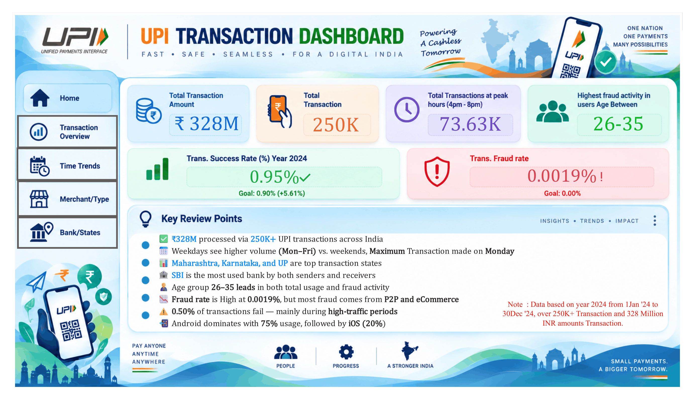
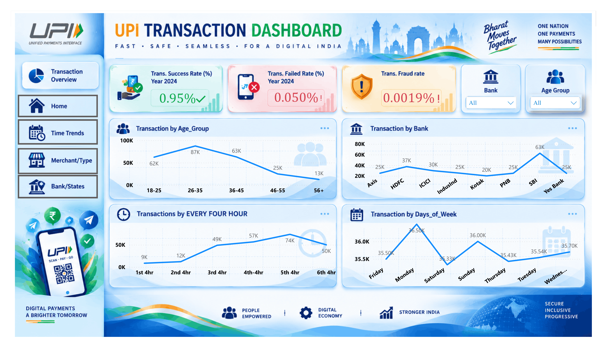
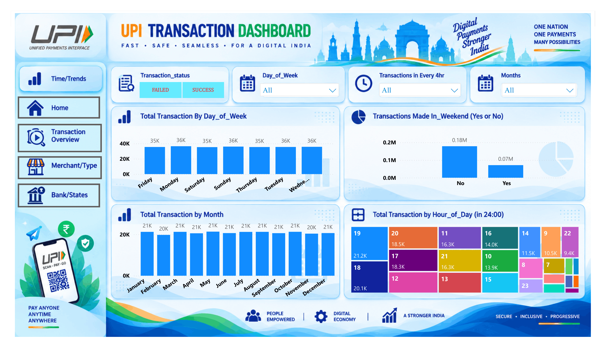
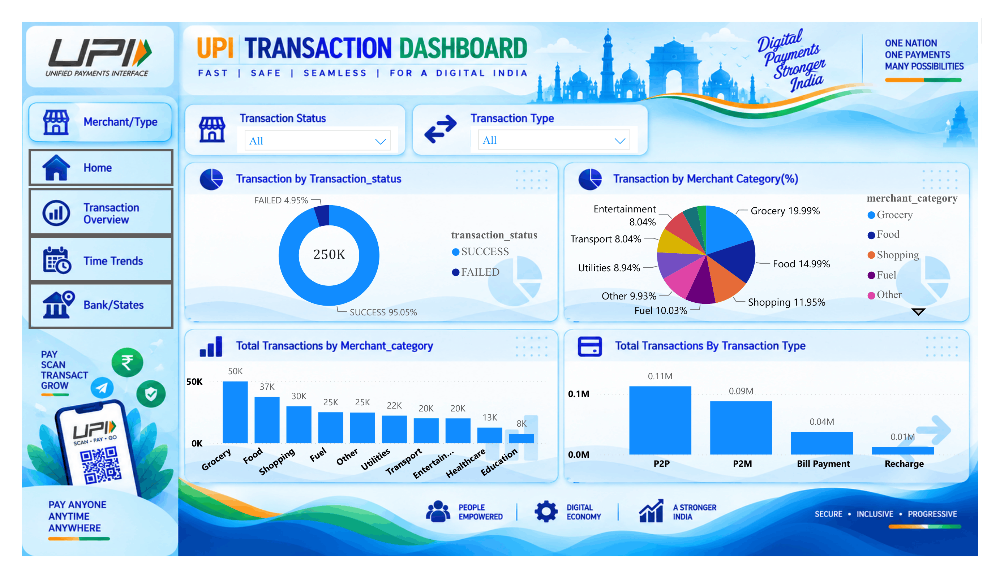
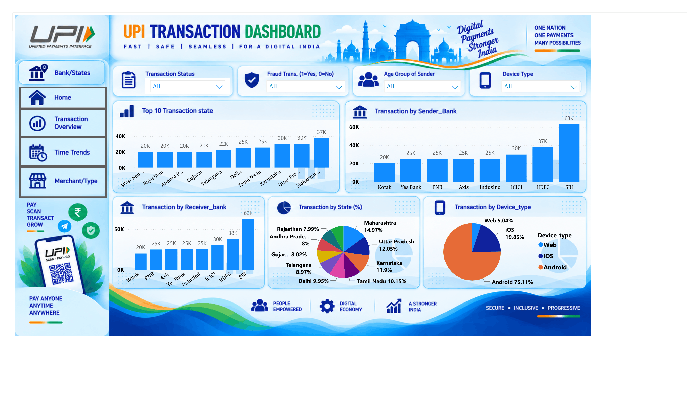

# 📊 UPI Transaction Analysis Dashboard — Power BI



An interactive **Power BI dashboard for analyzing UPI transaction activity across India**, covering transaction volume, time-based trends, transaction status, merchant categories, banks, states, age groups, devices, and fraud indicators.

> **Data period:** 1 January 2024 – 30 December 2024  
> **Coverage:** 250K+ transactions | **₹328M** transaction value

---

## 📌 Project Overview

This project presents a multi-page Power BI dashboard designed to turn UPI transaction data into clear, interactive insights.

The dashboard is organized into four analytical sections:

- 🏠 **Home** — Executive overview and key insights
- 📊 **Transaction Overview** — User age groups, banks, and transaction timing
- ⏱️ **Time / Trends** — Daily, monthly, weekend, and hourly patterns
- 🏪 **Merchant / Type** — Merchant categories, transaction status, and transaction types
- 🏦 **Bank / States** — State-wise, sender-bank, receiver-bank, and device analysis

Interactive slicers allow the dashboard to be explored by dimensions such as transaction status, transaction type, bank, state, fraud status, age group, device type, day, hour, and month.

---

## 🎯 Project Objective

The objective is to build a visually engaging dashboard that helps users:

- Monitor overall UPI transaction performance
- Understand transaction patterns across time
- Compare transaction activity across banks and states
- Analyze merchant and transaction-type behavior
- Examine transaction success and failure
- Identify fraud-related patterns
- Understand user demographics and device usage
- Present large-scale transaction data through interactive data storytelling

---

## 📊 Dashboard KPIs

| KPI | Dashboard Value |
|---|---:|
| 💰 Total Transaction Amount | **₹328M** |
| 🔢 Total Transactions | **250K+** |
| ⏰ Peak 4-Hour Transaction Volume | **73.63K** |
| 👥 Highest-Activity / Fraud Age Group | **26–35** |
| ✅ Transaction Success Rate | **95.05%** |
| ❌ Transaction Failure Rate | **4.95%** |
| 🚨 Transaction Fraud Rate | **0.0019%** |
| 📱 Android Device Share | **75.11%** |
| 🍎 iOS Device Share | **19.85%** |
| 🌐 Web Device Share | **5.04%** |

---

## 🔎 Key Insights

### 💰 Transaction Overview

- More than **250K UPI transactions** were analyzed, representing approximately **₹328M** in transaction value.
- The **26–35 age group** records the highest transaction activity at approximately **87K transactions**.
- The **36–45** and **18–25** groups follow with approximately **63K** and **62K** transactions respectively.
- **SBI** has the highest transaction volume among the analyzed banks.
- The dashboard shows approximately **63K SBI transactions**, followed by **HDFC (~37K)** and **ICICI (~30K)**.

### ⏱️ Time & Trends

- **Monday** records the highest transaction activity among the days of the week.
- Weekdays show substantially higher transaction volume than weekends.
- The dashboard records approximately **0.18M weekday transactions** versus **0.07M weekend transactions** in the displayed breakdown.
- The highest four-hour interval is the **4 PM–8 PM peak window**, with approximately **73.63K transactions**.
- Monthly transaction volume remains relatively consistent throughout 2024, at roughly **20K–21K transactions per month**.

### 🏪 Merchant & Transaction Type

The largest merchant categories shown on the dashboard are:

| Merchant Category | Share |
|---|---:|
| Grocery | **19.99%** |
| Food | **14.99%** |
| Shopping | **11.95%** |
| Fuel | **10.03%** |
| Other | **9.93%** |
| Utilities | **8.94%** |
| Transport | **8.04%** |
| Entertainment | **8.04%** |

Transaction types shown include:

- **P2P** — ~0.11M
- **P2M** — ~0.09M
- **Bill Payment** — ~0.04M
- **Recharge** — ~0.01M

### 🚨 Fraud & Transaction Status

- The dashboard reports an overall **fraud transaction rate of 0.0019%**.
- The **26–35 age group** is highlighted as having the highest fraud activity.
- The dashboard's transaction-status view shows:
  - **Success: 95.05%**
  - **Failed: 4.95%**
- Fraud-related analysis can be filtered using the **Fraud Transaction (Yes/No)** slicer.

### 📱 Device Usage

Device distribution is:

- **Android — 75.11%**
- **iOS — 19.85%**
- **Web — 5.04%**

### 🏦 Bank & State Analysis

The Bank / States page provides:

- Top 10 transaction states
- Sender-bank transaction volume
- Receiver-bank transaction volume
- State-wise transaction percentage
- Device-type distribution

The highest state shares shown are:

| State | Share |
|---|---:|
| Maharashtra | **14.97%** |
| Uttar Pradesh | **12.05%** |
| Karnataka | **11.90%** |
| Tamil Nadu | **10.15%** |
| Delhi | **9.95%** |
| Telangana | **8.97%** |
| Gujarat | **8.02%** |
| Andhra Pradesh | **8.00%** |
| Rajasthan | **7.99%** |

---

## 🗂️ Dashboard Pages

### 1. 🏠 Home

Executive-level summary containing:

- Total transaction amount
- Total transaction count
- Peak-hour transactions
- Highest fraud-activity age group
- Transaction success rate
- Fraud rate
- Key review points
- Overall transaction highlights

### 2. 📊 Transaction Overview

Contains:

- Transaction success rate
- Transaction failure rate
- Fraud rate
- Transactions by age group
- Transactions by bank
- Transactions by four-hour interval
- Transactions by day of week

### 3. ⏱️ Time / Trends

Contains:

- Total transactions by day of week
- Weekend vs. non-weekend transactions
- Monthly transaction volume
- Hour-of-day transaction distribution
- Filters for transaction status, day, four-hour interval, and month

### 4. 🏪 Merchant / Type

Contains:

- Transaction status breakdown
- Merchant-category percentage
- Total transactions by merchant category
- Total transactions by transaction type
- Filters for transaction status and transaction type

### 5. 🏦 Bank / States

Contains:

- Top 10 transaction states
- Transactions by sender bank
- Transactions by receiver bank
- State-wise transaction percentage
- Device-type distribution
- Filters for transaction status, fraud status, age group, and device type

---

## 🛠️ Tools & Technologies

- **Power BI Desktop**
- **DAX** — Measures and calculated metrics
- **Power Query** — Data cleaning and transformation
- **Data Visualization** — Charts, cards, slicers, KPI indicators
- **Dashboard Design** — Custom backgrounds, icons, shapes, navigation, and visual storytelling

---

## 📐 Analysis Areas

The dashboard analyzes UPI transactions across multiple dimensions:

```text
Transaction Data
│
├── Transaction Amount
├── Transaction Count
├── Transaction Status
├── Fraud Status
├── Transaction Type
├── Merchant Category
│
├── Time
│   ├── Date
│   ├── Month
│   ├── Day of Week
│   ├── Hour
│   └── Four-Hour Interval
│
├── User
│   └── Age Group
│
├── Banking
│   ├── Sender Bank
│   ├── Receiver Bank
│   └── State
│
└── Device
    ├── Android
    ├── iOS
    └── Web
```

---

## 🎛️ Interactive Filters

The dashboard uses slicers to enable dynamic analysis based on:

- Transaction Status
- Transaction Type
- Bank
- State
- Fraud Transaction
- Age Group
- Device Type
- Day of Week
- Four-Hour Interval
- Month

---

## 📁 Repository Structure

```text
UPI-Transaction-Dashboard/
│
├── README.md
├── UPI_Transaction_Dashboard.pdf
│
├── assets/
│   ├── upi-dashboard-cover.png
│   ├── transaction-overview.png
│   ├── time-trends.png
│   ├── merchant-type.png
│   └── bank-states.png

```

---

## 📸 Dashboard Preview

### 🏠 Home


### 📊 Transaction Overview



### ⏱️ Time / Trends



### 🏪 Merchant / Type



### 🏦 Bank / States



---

## 💡 Business Use Case

This dashboard can serve as a prototype for how a **bank, fintech company, payment network, or analytics team** could monitor digital payment activity.

Potential applications include:

- Transaction performance monitoring
- Failure-rate analysis
- Fraud monitoring
- Bank and state-level comparison
- Customer behavior analysis
- Peak-period identification
- Merchant-category analysis
- Device usage analysis
- Data-driven operational reporting

---

## ⚠️ Data Note

The dashboard represents transaction data for **2024**, covering **1 January 2024 to 30 December 2024**, with **250K+ transactions** and approximately **₹328M** in transaction value.

The dashboard is intended for **analytics, visualization, and educational/project demonstration purposes**. It should not be interpreted as official real-time UPI statistics.

---

## 👤 Author

**Saanvi Grover**

- [LinkedIn](https://www.linkedin.com/in/saanvi-grover-01a4b41b7/)
- [GitHub](https://github.com/SaiGrover)

---
